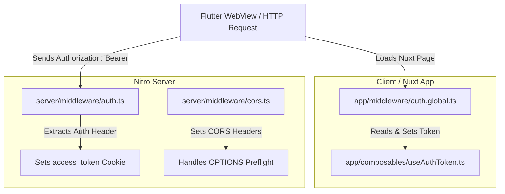

# Authentication & Middleware Codebase Analysis

## Executive Summary

The current authentication and middleware setup across the Nuxt client and Nitro server contains overlapping responsibilities, duplicate token interception logic, dead/commented-out code, and unnecessary dual-storage complexity. 

This document provides a detailed breakdown of the 4 targeted files, analyzes why the current code feels chaotic, and proposes a streamlined refactoring architecture.

---

## Current Architecture & File Roles



### Detailed File Breakdown

| File Path | Responsibility | Current Status & Pain Points |
| :--- | :--- | :--- |
| [`app/middleware/auth.global.ts`](file:///d:/UDAYA/github/PR_VET_Car_Rental_ReactJS/apps/vet-car-rental/app/middleware/auth.global.ts) | Nuxt Route Guard | **70% Dead Code.** Public path checks, token validation, user profile fetching, and unauthorized redirects are all commented out. Only header interception is active. |
| [`app/composables/useAuthToken.ts`](file:///d:/UDAYA/github/PR_VET_Car_Rental_ReactJS/apps/vet-car-rental/app/composables/useAuthToken.ts) | Token Storage Management | **Over-engineered Dual Storage.** Tries to branch between `localStorage` (dev/local) and `Cookie` (qa/prod), but inside `getToken` and `setToken` it reads/writes to **both** regardless of environment. |
| [`server/middleware/auth.ts`](file:///d:/UDAYA/github/PR_VET_Car_Rental_ReactJS/apps/vet-car-rental/server/middleware/auth.ts) | Nitro Server Middleware | **Duplicated Interception.** Intercepts incoming `Authorization: Bearer <token>` headers from initial HTTP requests (e.g. Flutter WebView load) and sets an `access_token` cookie. |
| [`server/middleware/cors.ts`](file:///d:/UDAYA/github/PR_VET_Car_Rental_ReactJS/apps/vet-car-rental/server/middleware/cors.ts) | Nitro CORS Handling | **Minor Inconsistency.** Header comment mentions `00.cors.ts` while the file is named `cors.ts`. Standard CORS header configuration. |

---

## Why the Code Feels "Messy, Chaotic, Disorganized"

> [!WARNING]
> **Issue 1: Duplicated Token Interception**
> Both `server/middleware/auth.ts` and `app/middleware/auth.global.ts` inspect the incoming `Authorization` HTTP header. Having both server and client route middleware try to parse headers independently causes race conditions and confusion about which layer owns authentication entry.

> [!CAUTION]
> **Issue 2: Dead / Commented Code Clutter**
> Lines 4–10 and 22–55 in `auth.global.ts` are entirely commented out. Developers reading the file cannot tell if route protection is supposed to be enabled, temporarily disabled, or deprecated.

> [!NOTE]
> **Issue 3: Desynchronized Storage in Composable**
> `useAuthToken.ts` checks environment flags (`VITE_NODE_ENV`) to decide whether to use `localStorage` or `Cookie`. However, Nuxt SSR runs on the server where `localStorage` does not exist. Using `useCookie()` as the single source of truth resolves SSR/hydration mismatches out of the box.

---

## Refactored Clean Architecture

In a standard Nuxt 3 application:
1. **Server Middleware (`server/middleware/auth.ts`)** extracts `Authorization: Bearer <token>` from HTTP request headers (from Flutter/native app) and writes it into a cookie.
2. **Composable (`useAuthToken.ts`)** wraps Nuxt's built-in `useCookie('access_token')` for simple, universal (SSR + Client) token access.
3. **Route Guard (`app/middleware/auth.global.ts`)** reads from `useAuthToken()`, handles route protection, and redirects unauthorized users cleanly.
4. **CORS Middleware (`server/middleware/cors.ts`)** maintains CORS rules without misleading inline comments.

---

## Proposed Clean Code Implementations

### 1. `server/middleware/auth.ts` (Server Layer)
```typescript
import { defineEventHandler, getRequestHeader, setCookie } from "h3";

export default defineEventHandler((event) => {
  // Extract Authorization header from incoming HTTP request (e.g., initial Flutter WebView load)
  const authHeader = getRequestHeader(event, "authorization");

  if (authHeader && authHeader.toLowerCase().startsWith("bearer ")) {
    const token = authHeader.substring(7).trim();

    if (token) {
      // Store token in cookie so Nuxt client & SSR pick it up seamlessly
      setCookie(event, "access_token", token, {
        path: "/",
        maxAge: 60 * 60 * 24 * 7, // 7 days
        httpOnly: false,
        sameSite: "lax",
      });
    }
  }
});
```

### 2. `app/composables/useAuthToken.ts` (Composable Layer)
```typescript
/**
 * Universal Auth Token Composable
 * Uses Nuxt `useCookie` as the single source of truth for both SSR and Client.
 */
export const useAuthToken = () => {
  const cookieToken = useCookie<string | null>("access_token", {
    path: "/",
    maxAge: 60 * 60 * 24 * 7,
  });

  const getToken = (): string | null => {
    return cookieToken.value || null;
  };

  const setToken = (token: string) => {
    cookieToken.value = token;
    // Optional fallback to localStorage for legacy client scripts if needed
    if (import.meta.client) {
      localStorage.setItem("access_token", token);
    }
  };

  const removeToken = () => {
    cookieToken.value = null;
    if (import.meta.client) {
      localStorage.removeItem("access_token");
    }
  };

  return {
    getToken,
    setToken,
    removeToken,
  };
};
```

### 3. `app/middleware/auth.global.ts` (Client Route Guard)
```typescript
export default defineNuxtRouteMiddleware((to) => {
  const { getToken, setToken } = useAuthToken();

  // Intercept Authorization header passed on SSR request
  const reqHeaders = useRequestHeaders(["authorization"]);
  if (reqHeaders.authorization && !getToken()) {
    const headerToken = reqHeaders.authorization.replace(/^Bearer\s+/i, "").trim();
    if (headerToken) {
      setToken(headerToken);
    }
  }

  // Active Route Guard Logic (Uncomment & customize when route protection is needed)
  // const publicPaths = ["/unauthorized", "/login"];
  // const isPublic = publicPaths.some((path) => to.path.endsWith(path));
  // if (!isPublic && !getToken()) {
  //   return navigateTo("/unauthorized", { replace: true });
  // }
});
```

### 4. `server/middleware/cors.ts` (CORS Layer)
```typescript
import { defineEventHandler, getHeader, getMethod, setResponseHeader, setResponseStatus } from "h3";

const ALLOWED_ORIGINS = [
  "http://localhost:3001",
  "null", // Allows local file testing via file:// protocol
];

export default defineEventHandler((event) => {
  const origin = getHeader(event, "origin");

  if (origin && (ALLOWED_ORIGINS.includes(origin) || import.meta.dev)) {
    setResponseHeader(event, "Access-Control-Allow-Origin", origin);
    setResponseHeader(event, "Access-Control-Allow-Credentials", "true");
  }

  setResponseHeader(event, "Access-Control-Allow-Methods", "GET, POST, OPTIONS, PUT, DELETE");
  setResponseHeader(event, "Access-Control-Allow-Headers", "Content-Type, Authorization, Accept, X-Requested-With");

  if (getMethod(event) === "OPTIONS") {
    setResponseStatus(event, 204);
    return "";
  }
});
```

---

## Summary of Benefits

1. **Clear Separation of Concerns:** Server middleware handles initial HTTP headers, composable manages cookie state, and route middleware handles client navigation.
2. **Zero Hydration Mismatches:** Nuxt `useCookie` seamlessly bridges Server-Side Rendering (SSR) and Client state.
3. **No Dead Code:** Removes 35+ lines of dead comments, making the codebase maintainable and readable.
